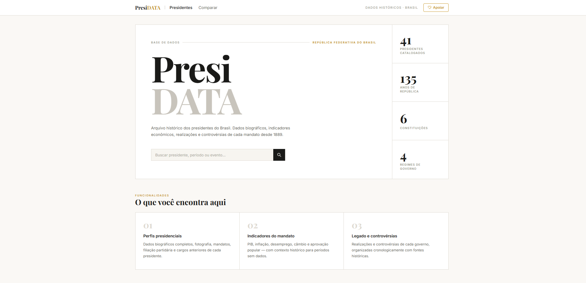

# PresiDATA

Plataforma web para explorar e comparar dados dos presidentes brasileiros desde o início da República. Busca inteligente, perfis detalhados e comparador interativo de mandatos.



🔗 **[presidata ao vivo →](https://ericdalaporta.github.io/presiDATA/)**

---

## Funcionalidades

- **Busca inteligente** — pesquisa por nome com correspondência fuzzy, sugestões em tempo real e navegação direta ao perfil
- **Perfil completo** — foto, assinatura, partido, duração do mandato, vice-presidente, indicadores econômicos (PIB, inflação, desemprego, câmbio, aprovação) e legado (realizações e controvérsias)
- **Comparador de mandatos** — dois presidentes lado a lado com tabela de indicadores, legado e veredicto automático
- **Catálogo completo** — todos os presidentes desde Deodoro da Fonseca (1889) em ordem cronológica reversa
- **Mobile-first** — header fixo com transparência ao scroll, menu hambúrguer, layout adaptado para cada breakpoint

## Tecnologias

| Camada | Ferramentas |
|--------|------------|
| Marcação | HTML5 semântico |
| Estilos | CSS3 puro — Inter + Playfair Display (Google Fonts) |
| Animações | GSAP + ScrollTrigger, AOS |
| Lógica | JavaScript ES6+ (sem frameworks) |
| Dados | JSON estático (`data/presidentes-db.json`) |
| Deploy | GitHub Pages |

## Estrutura

```
presiDATA/
├── assets/
│   ├── icons/           # Favicon e ícones SVG
│   └── images/
│       ├── presidentes/ # Fotos dos presidentes
│       └── presidata.png
├── css/
│   ├── variables.css    # Tokens de design (cores, tipografia)
│   ├── styles.css       # Base global
│   ├── index.css        # Página inicial
│   ├── presidente.css   # Página de perfil
│   ├── comparar.css     # Página de comparação
│   └── mobile.css       # Responsivo compartilhado
├── data/
│   └── presidentes-db.json   # Base com todos os presidentes
├── js/
│   ├── presimain.js     # Busca e catálogo (index)
│   ├── presidente.js    # Perfil detalhado
│   ├── compare.js       # Comparador de mandatos
│   ├── animations.js    # Gerenciador de animações
│   ├── president-card.js# Renderização de cartões
│   ├── mobile-menu.js   # Menu mobile + header scroll
│   ├── typewriter.js    # Efeito de digitação no placeholder
│   ├── particles.js     # Partículas de fundo
│   └── notifications.js # Sistema de notificações
├── index.html           # Página inicial
├── presidente.html      # Perfil de cada presidente
└── comparar.html        # Comparador de mandatos
```

## Executar localmente

```bash
git clone https://github.com/ericdalaporta/presiDATA.git
cd presiDATA
# Abra index.html no navegador ou use Live Server (VS Code)
```

Não há dependências de build — é HTML/CSS/JS puro.

## Licença

[MIT](LICENSE) © ericdalaporta

